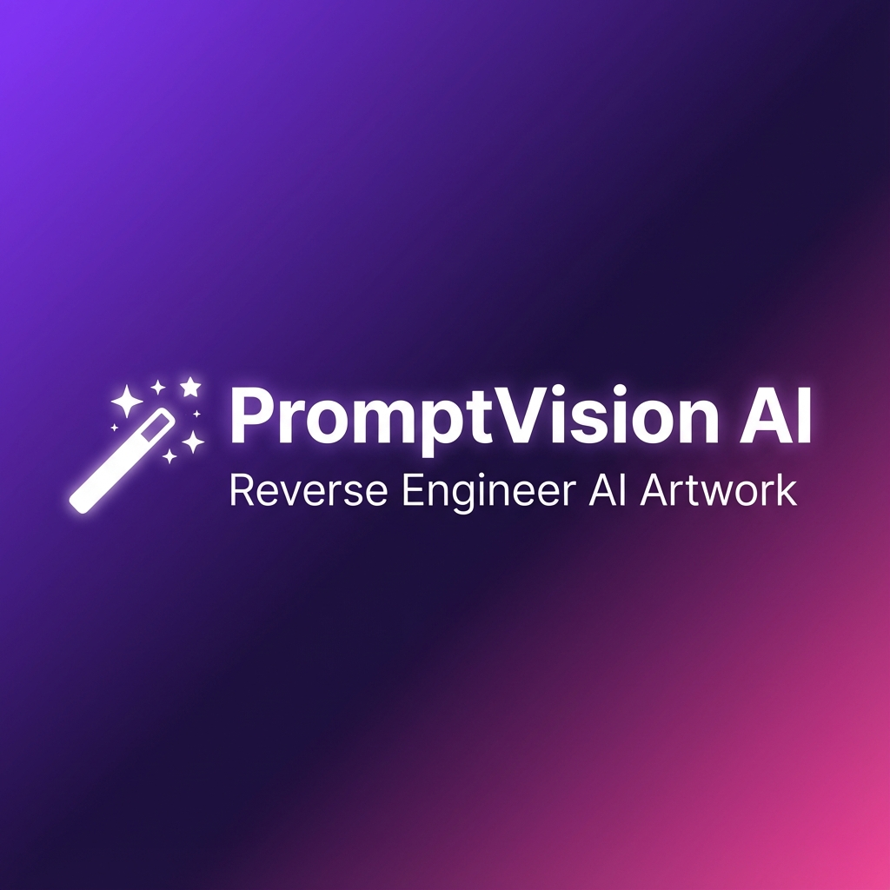
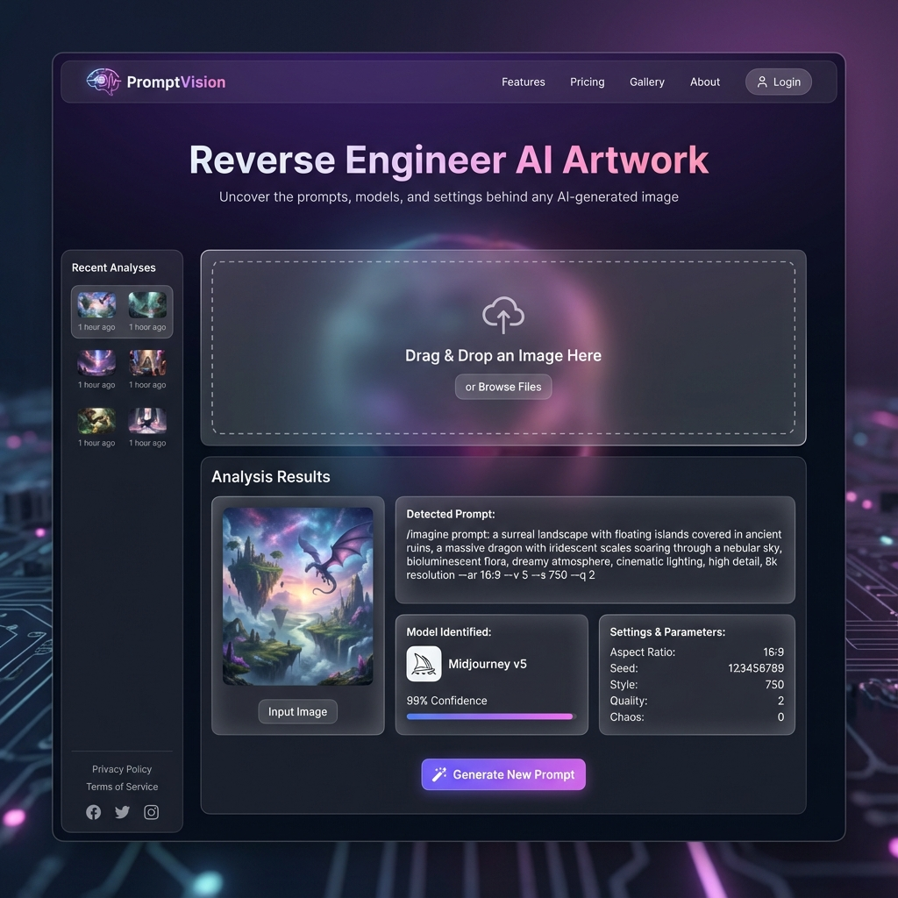

# PromptVision AI 🎨✨

> **The #1 AI Image Analyzer** - Reverse engineer any AI-generated artwork to discover the exact prompts, models, and settings used.



[](https://codingwithdodamani.github.io/PromptVision/)
[](LICENSE)
[](https://github.com/CodingWithDodamani)

---

## 🚀 Live Demo

**Try it now:** [https://codingwithdodamani.github.io/PromptVision/](https://codingwithdodamani.github.io/PromptVision/)



---

## ✨ Features

### 🔍 Core Analysis
- **AI Model Detection** - Identify Midjourney, DALL-E, Stable Diffusion, and 8+ more
- **Prompt Extraction** - Reverse engineer the exact prompts used
- **Settings Detection** - Discover aspect ratios, versions, and parameters

### 📊 Advanced Modes
| Mode | Description |
|------|-------------|
| **Single** | Analyze one image at a time |
| **Comparison** | Compare 2 images side-by-side |
| **Batch** | Process up to 5 images at once |

### 🎯 Productivity Tools
- **📚 Prompt Templates** - 12+ pre-built style templates
- **🔄 Prompt Variations** - Generate alternative prompts
- **📥 Export** - Download as PNG or JSON
- **📜 History** - Access previous analyses

### 🎨 Premium UI/UX
- **Dark/Light Mode** - System preference detection
- **Particle Effects** - Floating animated particles
- **Glassmorphism** - Modern frosted glass design
- **Smooth Animations** - Micro-interactions throughout

### 📱 Progressive Web App
- **Installable** - Add to home screen
- **Offline Support** - Works without internet
- **Responsive** - Mobile-first design

---

## 🛠️ Tech Stack

| Technology | Purpose |
|------------|---------|
|  | Structure |
|  | Styling |
|  | Logic |
|  | Utility CSS |
|  | Offline Support |

---

## 📂 Project Structure

```
PromptVision/
├── assets/
│   ├── css/
│   │   └── styles.css          # Custom styles
│   ├── images/
│   │   ├── favicon.svg         # SVG favicon
│   │   ├── favicon.png         # PNG favicon
│   │   ├── og-image.png        # Social share image
│   │   └── developer.png       # About page photo
│   └── js/
│       └── main.js             # Main JavaScript
├── index.html                  # Home page
├── about.html                  # About page
├── pricing.html                # Pricing page
├── changelog.html              # Version history
├── privacy.html                # Privacy policy
├── 404.html                    # Error page
├── manifest.json               # PWA manifest
├── sw.js                       # Service worker
└── README.md                   # This file
```

---

## 🚀 Getting Started

### Quick Start
1. **Clone the repository**
   ```bash
   git clone https://github.com/CodingWithDodamani/PromptVision.git
   ```

2. **Open in browser**
   ```bash
   cd PromptVision
   # Just open index.html in your browser!
   ```

3. **Or use Live Server**
   ```bash
   npx live-server
   ```

### No Build Required! 
This is a static site - just open `index.html` in any browser.

---

## 📖 How to Use

1. **Upload an image** - Drag & drop, click to browse, or paste from clipboard
2. **Wait for analysis** - AI analyzes your image in seconds
3. **View results** - See detected prompt, model, and settings
4. **Copy & use** - Click to copy the prompt for your own creations

### Keyboard Shortcuts
| Shortcut | Action |
|----------|--------|
| `Ctrl+V` | Paste image from clipboard |
| `Ctrl+D` | Toggle dark/light mode |
| `Enter` | Start analysis |

---

## 🌟 Screenshots

### Home Page


### Dark Mode
The app automatically adapts to your system theme preference!

---

## 📝 Changelog

### v3.0 (January 2025) - Latest
- ✨ Comparison Mode
- ✨ Batch Analysis
- ✨ Prompt Templates
- ✨ Onboarding Tutorial
- 🎨 Premium visual upgrade

### v2.0 (December 2024)
- ✨ Gemini Vision API integration
- ✨ History feature
- ✨ Export to PNG/JSON
- ✨ Prompt Variations

### v1.0 (December 2024)
- 🎉 Initial release
- ✨ Core image analysis
- ✨ Dark mode
- ✨ PWA support

---

## 🤝 Contributing

Contributions are welcome! Feel free to:

1. Fork the repository
2. Create a feature branch (`git checkout -b feature/amazing-feature`)
3. Commit changes (`git commit -m 'Add amazing feature'`)
4. Push to branch (`git push origin feature/amazing-feature`)
5. Open a Pull Request

---

## 📄 License

This project is licensed under the MIT License - see the [LICENSE](LICENSE) file for details.

---

## 👨‍💻 Author

**Hallu Dodamani**

[](https://github.com/CodingWithDodamani)
[](https://linkedin.com/in/halludodamani)
[](https://twitter.com/halludodamani)

---

## ⭐ Support

If you found this project helpful, please consider:

- ⭐ **Starring** this repository
- 🐛 **Reporting** bugs or issues
- 💡 **Suggesting** new features
- 📢 **Sharing** with others

---

<div align="center">

**Made with ❤️ by [Hallu Dodamani](https://github.com/CodingWithDodamani)**

</div>
